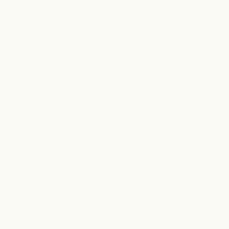

# pixelpad · 24×24 原生像素画 Agent Skill

<p align="center">
  
</p>

在 24×24 画布上画**原生像素图**——每个像素直接落一个调色板索引，而不是"生成大图再降采样"。所以边缘是硬的，每一格都有人管。

Draw **native** 24×24 pixel art: every pixel is a palette index placed on purpose, never a downscaled big image.

## 装

```bash
git clone --depth 1 https://github.com/ourword-ai/pixelpad.git
cp -r pixelpad ~/.claude/skills/pixelpad
pip install pillow
```

然后直接跟 agent 说：**「画一个像素风的红蘑菇」**。

## 用

```bash
python3 pixelpad.py draw examples/mushroom.pxl -o out/mushroom.png -p ember --gif
python3 pixelpad.py check out/mushroom.png     # 自检报告
python3 pixelpad.py palettes                   # 调色板列表
```

`.pxl` 脚本就是每行一句绘图原语：

```python
ellipse(11, 9, 10, 7, 2)   # 伞盖
rect(8, 15, 7, 8, 3)       # 菌柄
pix(6, 7, 4)               # 高光
pix(15, 6, 4)
outline(1)                 # 描边
```

原语：`rect · ellipse · tri · line · pix · mirror_x · mirror_y · replace · shift · outline`
调色板索引固定语义：`0` 透明 · `1` 描边 · `2` 主色 · `3` 辅色 · `4` 高光

## 为什么它能画得像样

**不是靠一次成型，是靠回环。** SKILL.md 教 agent 的流程是：规划部件 → 写十来行原语 → 渲染 → **打开 PNG 真的看一眼** → 按自检报告和肉眼判断修 → 再渲染。通常两轮，从"一团色"变成"能用"。

引擎每次渲染都会打印自检：覆盖率、四边边距、用色数、孤立像素数，并直接点出问题（主体太小 / 偏了 / 太平 / 有噪点）。

## 特点

- **全本地**：不调用任何图像生成 API，提示词和图都不出你的机器
- **逐像素显影动画**：`--gif` 导出蛇形 4×4 块顺序的生成过程
- **双份输出**：放大图 + 真 24×24 原图（`@1x.png`），可直接进游戏引擎
- **11 套调色板**，也可在 `palettes.json` 里加自己的

## 适合 / 不适合

适合：游戏精灵、图标、头像、道具、食物、动物头、徽章——**单个主体**。
不适合：整幅场景、多角色、写实人脸——24×24 装不下，换更大画布或别的工具。

## License

MIT
